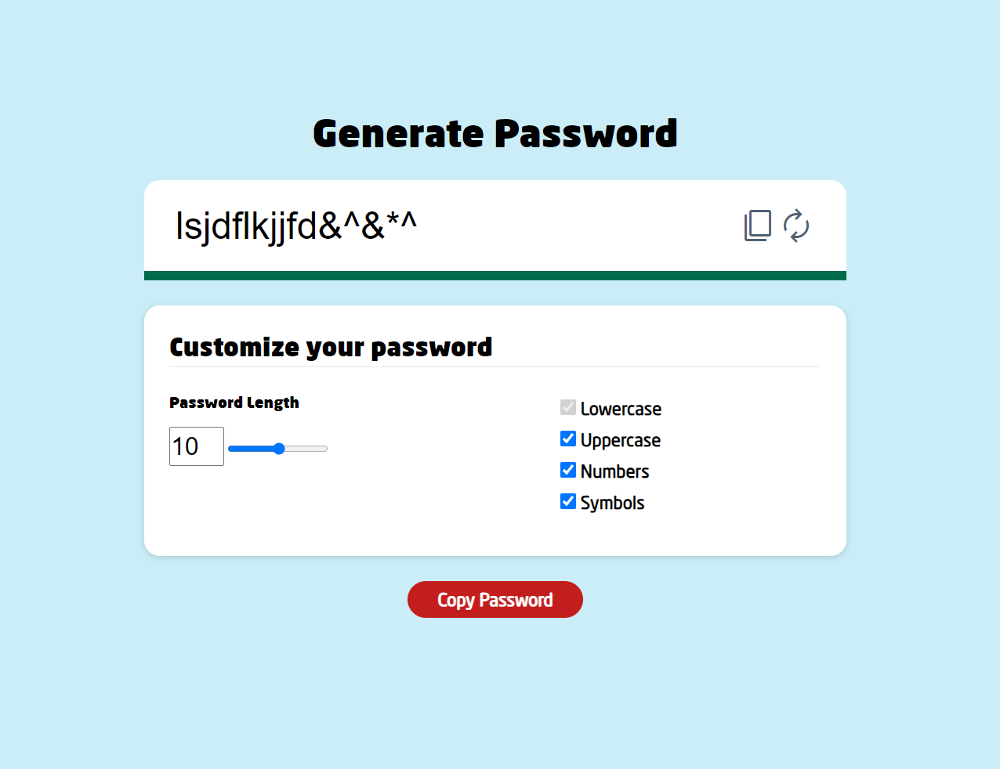

# JavaScript Password Generator

A simple password generator built with JavaScript that allows users to customize their passwords based on length and character types.

## Features

- Generate random passwords with customizable options.
- Choose password length.
- Include uppercase letters, lowercase letters, numbers, and symbols.
- Copy the generated password to the clipboard.

## Usage

1. Clone this repository to your local machine.
2. Open `index.html` in your web browser.
3. Customize the password options.
4. Copy the generated password using the "Copy Password" button.

## Screenshots

## Technologies Used

- HTML
- CSS
- JavaScript