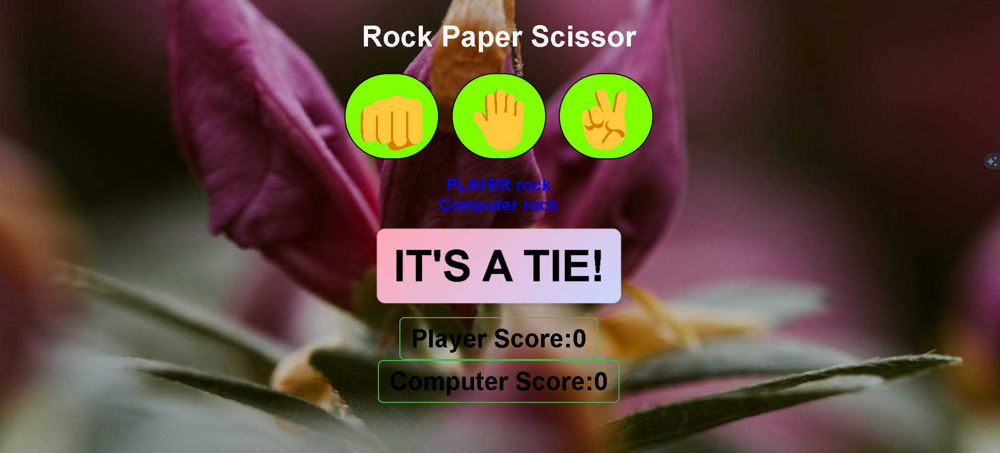
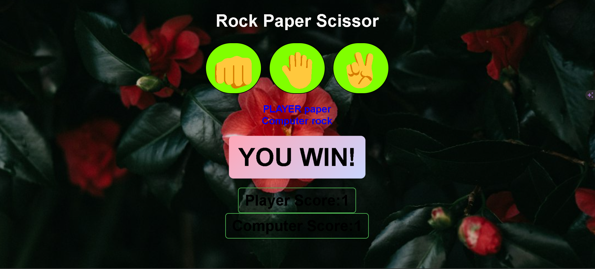
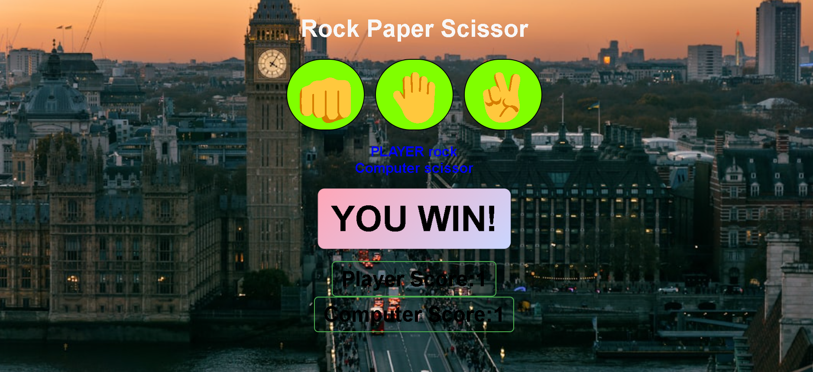
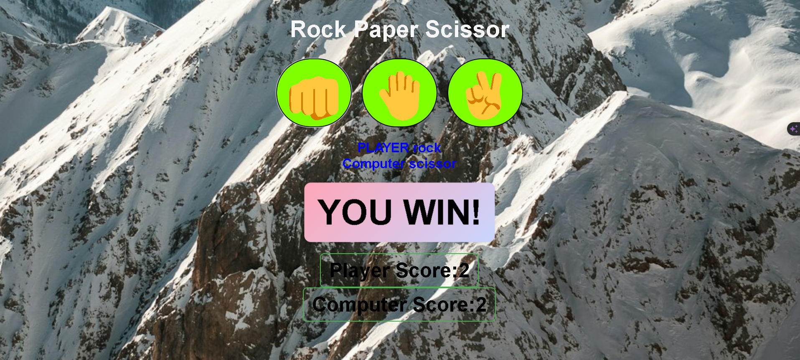

### Rock Paper Scissors Game

# Description :- 

This is a simple Rock Paper Scissors game implemented in JavaScript. The game allows users to play against the computer in a classic game of Rock Paper Scissors.

#  How to Play

✨ Getting Started: Open the index.html file in a web browser to start the game.

💫 Game Rules:

      Rock beats Scissors
      Scissors beats Paper
      Paper beats Rock
      
💫 Gameplay:

    Click on the "Rock", "Paper", or "Scissors" button to make your choice.
    The computer will randomly choose its move.
    The winner of the round will be displayed on the screen.
    Keep playing until you want to stop.
    
# 💫 Technologies Used

      HTML5
      CSS3
      JavaScript
      
# ⭕ Features:- 

Interactive gameplay with user input.
Random computer move generation.
Real-time result display.

<h1 align = "center"> ✨THANK YOU✨ </h1>
